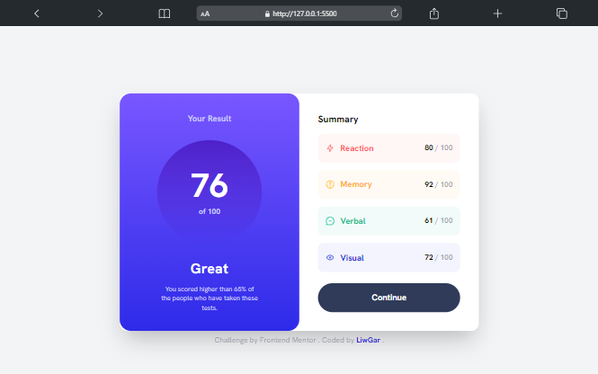
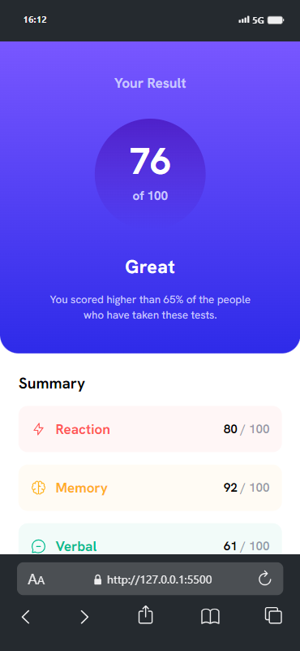

# Welcome! 👋

# Frontend Mentor - Results summary component solution

This is a solution to the [Results summary component challenge on Frontend Mentor](https://www.frontendmentor.io/challenges/results-summary-component-CE_K6s0maV). Frontend Mentor challenges help you improve your coding skills by building realistic projects. 

## Table of contents

- [Overview](#overview)
  - [The challenge](#the-challenge)
  - [Screenshot](#screenshot)
  - [Links](#links)
- [My process](#my-process)
  - [Built with](#built-with)
  - [What I learned](#what-i-learned)
  - [Continued development](#continued-development)
- [Author](#author)

## Overview

### The challenge

Users should be able to:

- View the optimal layout for the interface depending on their device's screen size
- See hover and focus states for all interactive elements on the page

### Screenshot

### Links

- Live Site URL: [Results summary component](https://liwgar.github.io/003_FM_Result_Summary_Component/)

## My process

### Built with

- Git & Github.
- Semantic HTML5 markup
- CSS custom properties
- Flexbox
- CSS Grid
- Mobile-first workflow
- [TailwindCSS](https://tailwindcss.com/) - For styles

### What I learned

- Apply responsive design for any device.
- Apply flexbox and grid.
- Improve semantic HTML5 markup.
- Improve CSS custom properties.

### Continued development

The objective is:
- Improve the practice of styles with flexbox and grid.

## Author

- Website - [LiwGAr](https://liwgar-portfolio.vercel.app/)
- Frontend Mentor - [@Liwgar](https://www.frontendmentor.io/profile/LiwGar)

# I've just completed a front-end coding challenge from @frontendmentor! 🎉

You can see my solution here: https://www.frontendmentor.io/solutions/responsive-resultsummarycomponent-using-tailwindcss-KlrXgaX9ZE

Any suggestions on how I can improve are welcome!

